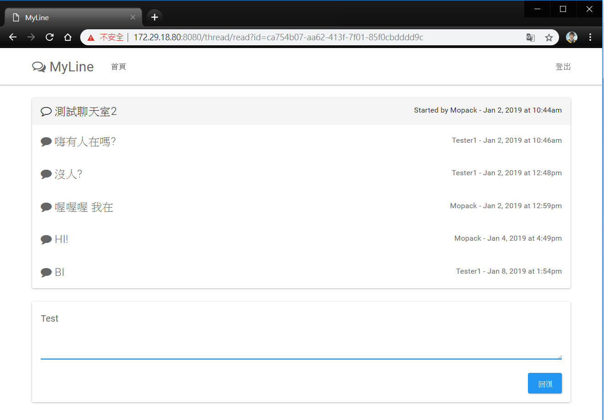

## 聊天程式實作 (Golang & Cocos Creator)

### 實作一：

 * 此實作試圖透過Golang語言，使用內建的HTTP1.1協定，以瀏覽器為客戶端發送HTTP請求，
 而Go的Server會透過多工復用器(Multiplexer, Mux)，分配至請求相應的Handler函數，
 Handler會向PostgreSQL的資料庫存取相應資料後，將HTML樣板渲染後回應至客戶端桌面。

 * 此實作功能包括：建立帳號、驗證帳密正確性、登入/登出、建立新聊天群、在特定聊天群回
 應會話(登入模式限定)。

### 實作二：

 * 此實作將前作鑲嵌至一個Cocos遊戲中，前作將在這遊戲中分成登入/登出介面，以及聊天室
 介面。此遊戲包括多國語言設定(簡體、繁體、英文)，且能夠於Windows桌面、網頁、
 手機網頁以及Android手機上運行。
 
 ## 成果展示

### 實作一：

* 首頁：

 

* 登入：

 

* 建立新聊天群：

 

* 發送回應：

 

* 建立新帳號：

 

### 實作二：

* 登入場景：

 

* 登入完成：

 

* 多國語言設定場景：

 

* 魔法森林(聊天室)場景：

 

* 手機Web展示：

 

* 手機Android(.apk) 展示 (WebView無法顯示)：

 

* Win32(.exe) 展示 (WebView無法顯示)：

 

## 架構

* 網頁架構：

 

* 整體架構：

 

